# **一、版本**

| 版本 | 日期 | 内容 | 修改人 | 备注 |
| --- | --- | --- | --- | --- |
| 1.0.0 | 2025年12月25日 | 新增 | 张旭 |  |
| 1.0.1 | 2025年12月25日 | 修改 一、金刚位 1、金刚位：适用渠道区分APP,微信小程序，APP多语言必填，微信小程序仅简体中文必填 2、金刚位：跳转类型增加“url schema” 3、金刚为：支持按照不同渠道配置对应跳转； 二、广告位 1、广告位列表：增加广告类型查询及列表展示 2、新增编辑广告位：增加广告位类型、广告尺寸配置 三、资源位 1、新增修改资源位：跳转类型增加“url schema” 2、新增修改资源位：支持按照不同渠道配置对应跳转； 3、新增修改资源位：适用渠道区分APP,微信小程序，APP多语言必填，微信小程序仅简体中文必填 四、退货原因配置 1、支持退货原因编辑弹窗日志删除统一在列表展示 | 张旭 |  |
| 1.0.2 | 2025年12月30日 | 退货原因配置 1、查询条件：删除创建时间查询条件 2、查询条件：新增外显二级数据名称 3、列表：删除创建时间 ~~4、列表：新增外显二级数据名称~~ ~~5、新增/修改：增加对应多语言外显二级数据名称配置~~ 6、新增/修改：增加是否对外展示配置 | 张旭 |  |
| 1.0.3 | 2026年1月4日 | 金刚位配置、资源配置、热门标签配置增加排序分数字段，删除页面排序按钮 | 张旭 |  |
| 1.0.4 | 2026年1月4日 | 新增：APP更新配置 | 张旭 |  |

# **二、需求背景**

【需求背景】：出行日本项目mvp版本

【需求目的】：后台系统增加公共模块（金刚位配置、广告位配置（资源配置）、热门标签配置、退货原因字段配置）

# 三、详细需求

## 3.1金刚位配置

| **功能** | **原型** | **说明** |
| --- | --- | --- |
| 1.0金刚位配置列表 | 1.0.1前端页面demo 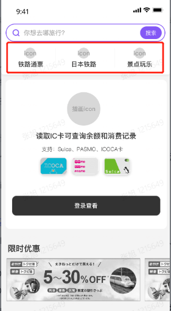 1.0.2列表 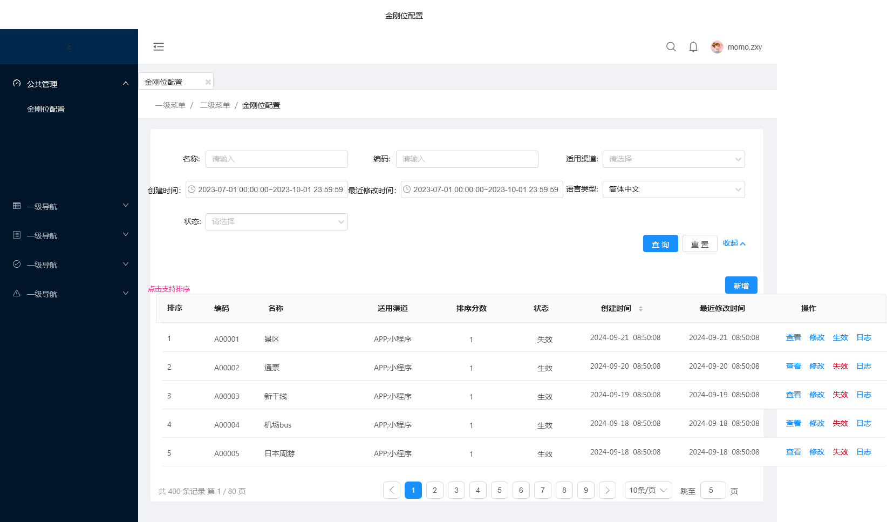 1.0.3新增/编辑 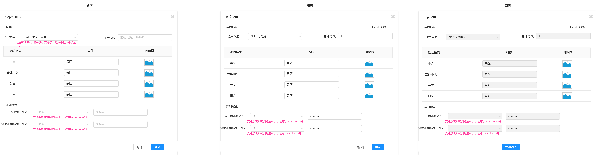 | 列表查询 1、名称：默认为空可查询全部，支持输入名称模糊搜索 2、编码：默认为空可查询全部，支持输入编码进行精准搜索 3、适用渠道：默认为空可查询全部，支持下拉单选“微信小程序”“APP” 4、创建时间：默认为空可查询全部，支持人工填写查询时间区间查询； 5、最近修改时间：默认为空可查询全部，支持人工填写查询时间区间查询； 6、语言类型：默认简体中文，支持下拉单选繁体中文、英文、日文 7、状态：默认为空可查询全部，支持下拉单选“生效”“失效” 列表展示 1、列表依次展示：排序、编码、名称、适用渠道、状态、创建时间、最近修改时间 2、排序列表按钮：支持点击调整金刚位排序 操作按钮 1、查看：点击进入金刚位查看页面 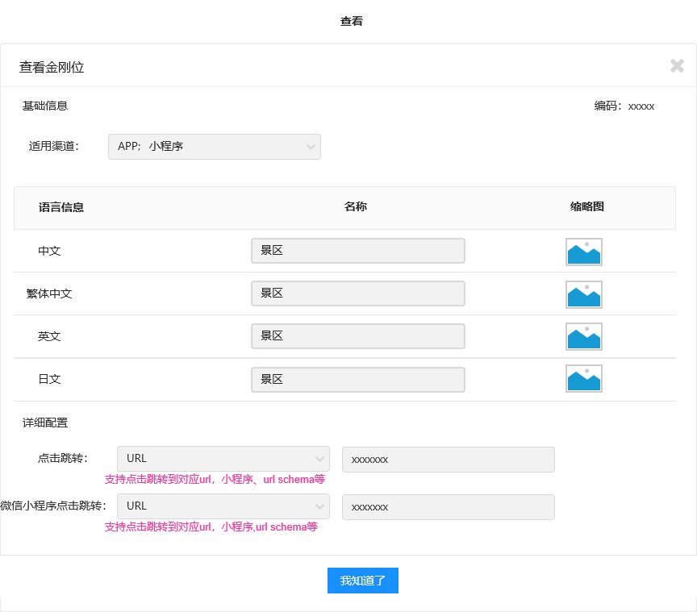 2、修改：点击进入修改页面 3、生效、失效按钮：点击展示二次提示弹窗，点击确认后，对应金刚位状态更新，对应APP、微信小程序更新展示信息；  4、日志：点击展示对应数据创建、修改日志，按照时间倒序展示  |
| 新增/编辑金刚位 1、适用渠道：必填项，支持点击下拉多选“APP”“微信小程序” 2、基础信息：必填项，支持中文、英文、繁体中文、日文进行名称录入，若只选择“微信小程序”渠道，则只有简体中文必填； 3、icon图：必填项，支持按多语言纬度配置icon图 4、适用渠道：必填项，支持点击下拉多选“APP”“微信小程序” 5、点击跳转：必填项，支持点击选择跳转类型“url”“小程序”“schema”，输入框填写对应url或小程序、“schema”跳转链接，若同时选择“APP”“微信小程序”则系统区分两个渠道进行配置 6、编码自动生成：编码规则DP开头+六位数字累加，如DP000001 ==7、排序分数：必填，若值一样则按照创建时间倒序排序，支持人工输入最大99999，分数越大排序越高；== APP支持多语言配置，小程序支持中文，支持原生页面跳转 |  |  |

## 3.2广告位配置

| **功能** | **原型** | **说明** |
| --- | --- | --- |
| 2.1广告位管理 | 2.1.0广告位列表 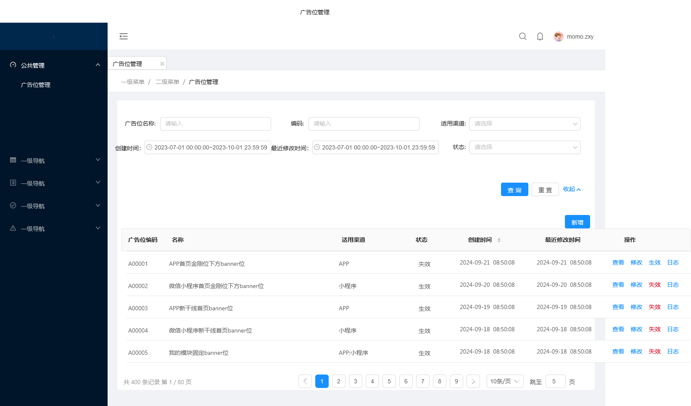 2.1.1新增/编辑广告位 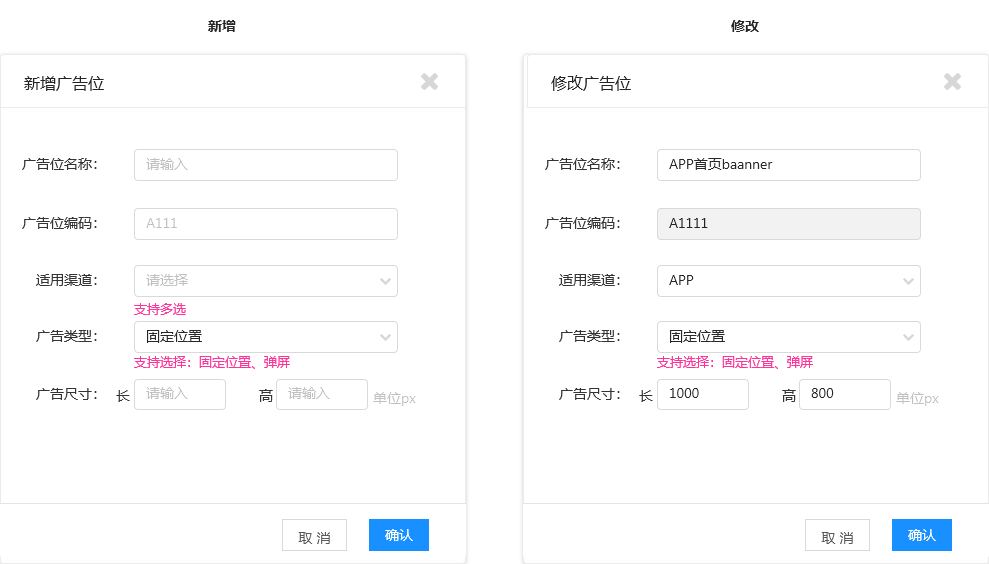 | 列表查询 1、名称：默认为空可查询全部，支持输入名称模糊搜索 2、编码：默认为空可查询全部，支持输入编码进行精准搜索 3、适用渠道：默认为空可查询全部，支持下拉单选“微信小程序”“APP” 4、创建时间：默认为空可查询全部，支持人工填写查询时间区间查询； 5、最近修改时间：默认为空可查询全部，支持人工填写查询时间区间查询； 6、状态：默认为空可查询全部，支持下拉单选“生效”“失效” 列表展示 1、列表依次展示：广告位编码、名称、适用渠道、状态、创建时间、最近修改时间 操作按钮 1、查看：点击进入查看页面 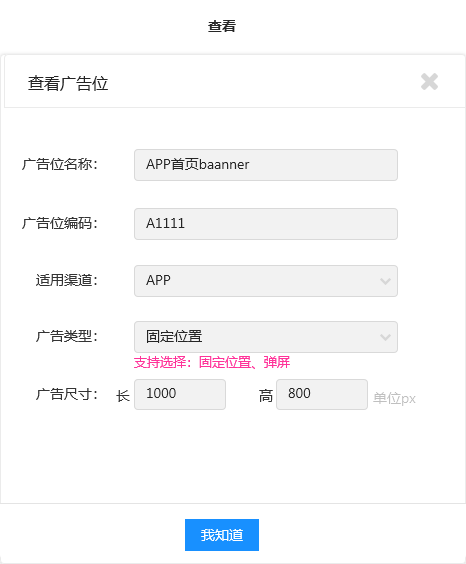 2、修改：点击进入修改页面 3、生效、失效按钮：点击展示二次提示弹窗，点击确认后，对应金刚位状态更新，对应APP、微信小程序更新展示信息；  4、日志：点击展示对应数据创建、修改日志，按照时间倒序展示 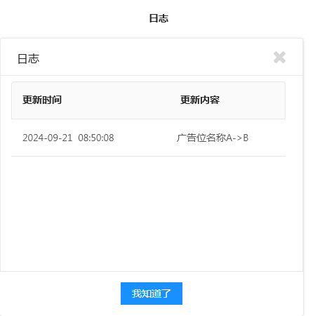 新增/编辑广告位 1、广告位名称：必填，文本输入，最多50个字，校验填写唯一性 2、广告位编码：必填，系统默认生成推荐编码，支持人工调整，若修改时则不可修改广告位编码 3、适用渠道：必填项，支持点击下拉多选“APP”“微信小程序” 4、广告类型：必填项，默认固定位置，支持下拉单选“固定位置”“弹屏” 5、广告尺寸：必填项，支持分别按照长、高填写，填写范围最小1，最大99999整数 |
| 2.2资源配置 | 2.2.0资源列表 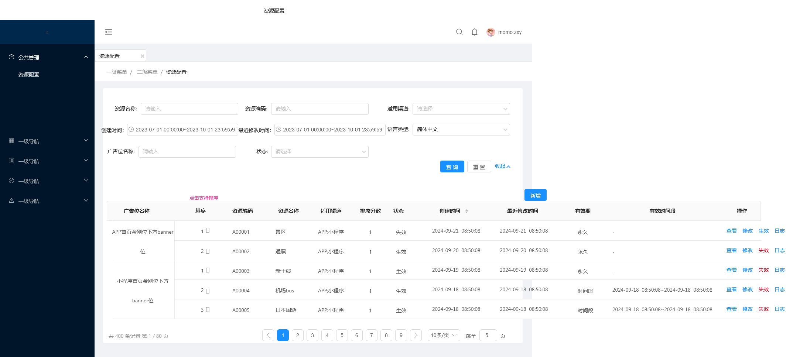 2.2.1新增/修改资源 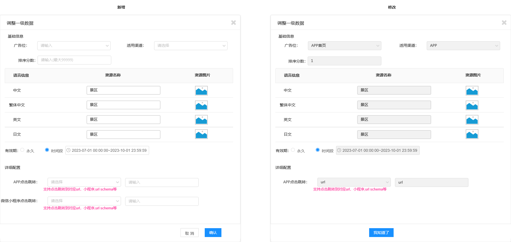 | 列表查询 1、名称：默认为空可查询全部，支持输入名称模糊搜索 2、编码：默认为空可查询全部，支持输入编码进行精准搜索 3、适用渠道：默认为空可查询全部，支持下拉单选“微信小程序”“APP” 4、创建时间：默认为空可查询全部，支持人工填写查询时间区间查询； 5、最近修改时间：默认为空可查询全部，支持人工填写查询时间区间查询； 6、状态：默认为空可查询全部，支持下拉单选“生效”“失效” 7、广告位名称：默认为空可查询全部，支持输入名称模糊搜索 8、语言类型：默认简体中文，支持下拉单选繁体中文、英文、日文 列表展示 1、列表依次展示：广告位名称、排序、资源编码、资源名称、适用渠道、状态、创建时间、最近修改时间、有效期、有效时间段 2、排序列表按钮：支持点击调整某个广告位下对应资源位排序，资源排序不支持跨广告位排序； 操作按钮 1、查看：点击进入查看页面 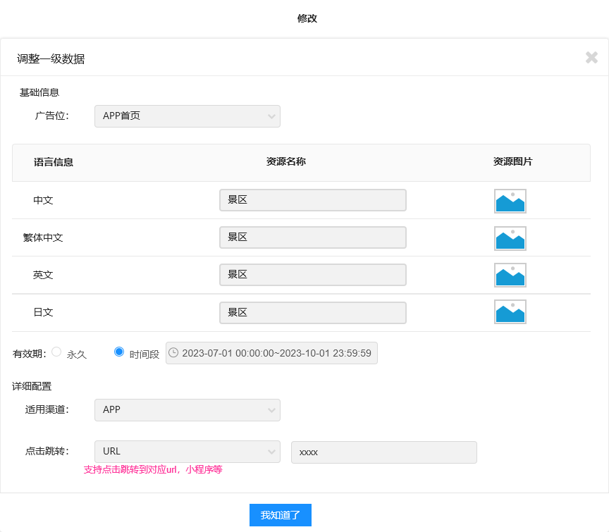 2、修改：点击进入修改页面 3、生效、失效按钮：点击展示二次提示弹窗，点击确认后，对应金刚位状态更新，对应APP、微信小程序更新展示信息；  4、日志：点击展示对应数据创建、修改日志，按照时间倒序展示 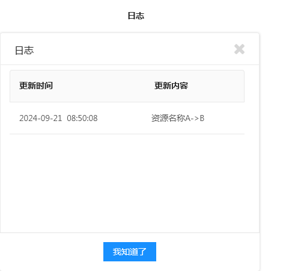 |
| 新增/修改资源 新增/编辑金刚位 1、广告位：必填，支持输入广告位名称模糊查询列表展示（编码+名称），点击选择确认广告位名称 2、适用渠道：必填项，支持点击下拉多选“APP”“微信小程序” 3、资源名称：必填项，支持中文、英文、繁体中文、日文进行名称录入,若只选择“微信小程序”渠道，则只有简体中文必填； 4、资源图片：必填项，支持按多语言纬度配置资源图 5、有效期：单选框，默认永久，支持选择时间段，点击时间段展示时间选择框，精准到秒 6、点击跳转：必填项，支持点击选择跳转类型“url”“小程序”“schema”，输入框填写对应url或小程序、“schema”跳转链接，若同时选择“APP”“微信小程序”则系统区分两个渠道进行配置 ==7、排序分数：排序分数：必填，若值一样则按照创建时间倒序排序，支持人工输入最大99999，分数越大排序越高；== |  |  |

## 3.3热门标签配置

| **功能** | **原型** | **说明** |
| --- | --- | --- |
| 3.1热门标签 | 3.1.0热门标签列表 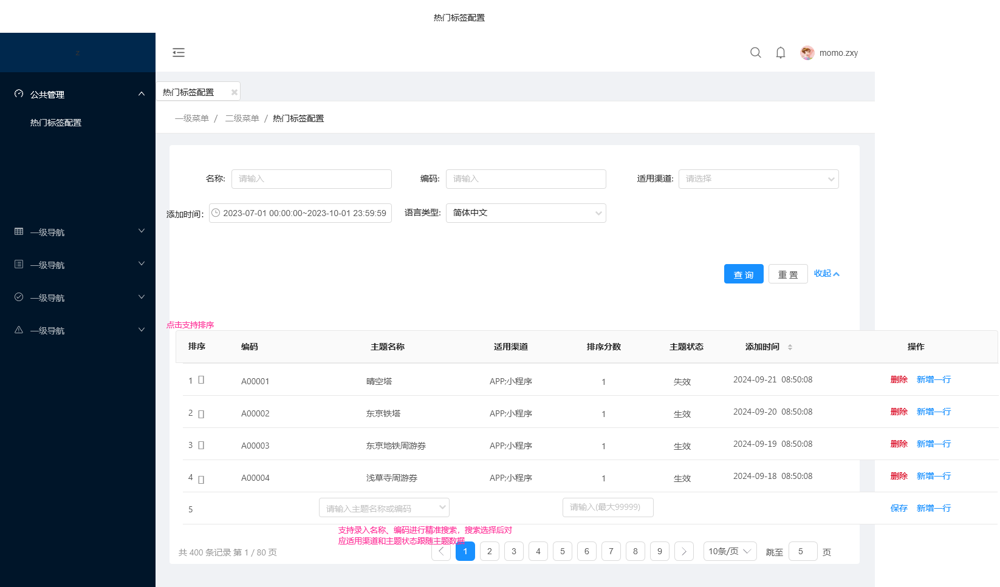 3.1.1前端展示 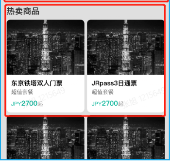 | 列表查询 1、名称：默认为空可查询全部，支持输入名称模糊搜索 ~~2、编码：默认为空可查询全部，支持输入编码进行精准搜索~~ 3、适用渠道：默认为空可查询全部，支持下拉单选“微信小程序”“APP” 4、添加时间：默认为空可查询全部，支持人工填写查询时间区间查询； 5、语言类型：默认简体中文，支持下拉单选繁体中文、英文、日文 列表展示 1、列表依次展示：排序、编码、主题名称、适用渠道、主题状态、添加时间 ~~2、排序列表按钮：支持点击调整排序；~~ 操作按钮 1、删除：已添加的商品点击【删除】展示二次提示弹窗，确认后删除； 2、新增一行： ==3、排序分数：排序分数：必填，若值一样则按照创建时间倒序排序，支持人工输入最大99999，分数越大排序越高；== 4、保存：列表操作按钮默认展示，点击列表新增一行，展示主题填写“支持录入名称、编码进行精准搜索，搜索选择后对应适用渠道和主题状态跟随主题数据” |

## 3.3退货原因字段配置

| **功能** | **原型** | **说明** |
| --- | --- | --- |
|  | 3.1.1退货原因列表  3.1.2新增/修改数据 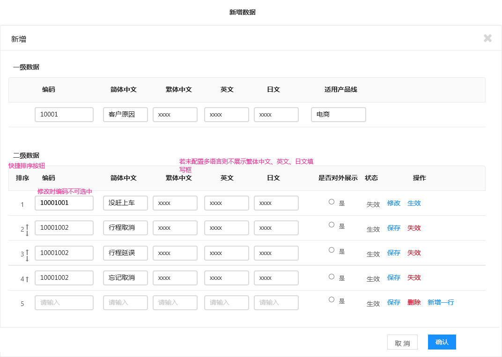 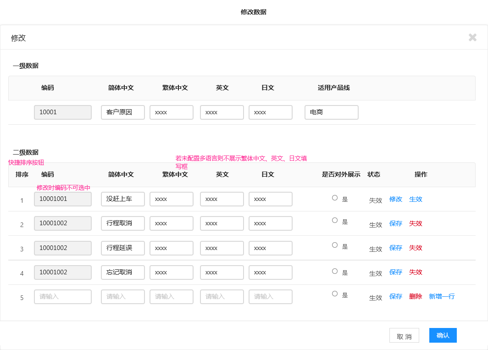 | 列表查询 1、一级编码：默认为空可查询全部，支持输入编码进行精准搜索 2、一级数据名称：默认为空可查询全部，支持输入名称模糊搜索 3、二级数据编码：默认为空可查询全部，支持输入编码进行精准搜索4 4、二级数据名称：默认为空可查询全部，支持输入名称模糊搜索 ~~5、~~~~创建时间：默认为空可查询全部，支持人工填写查询时间区间查询；~~ 6、最近修改时间：默认为空可查询全部，支持人工填写查询时间区间查询； 7、状态：默认为空可查询全部，支持下拉单选“生效”“失效” 8、语言类型：默认简体中文，支持下拉单选繁体中文、英文、日文 9、适用产品线：默认为空可查询全部，支持下拉单选”新干线“”电商“ ~~10、外显二级数据名称：默认为空可查询全部，支持输入名称模糊搜索~~ 列表展示 1、列表依次展示：一级编码、一级数据名称、二级数据名称、~~外显二级数据名称~~、适用产品线；创建时间、状态、最近修改时间 操作按钮 1、新增数据：点击进入新增数据按钮 2、查看：点击进入查看页面 3、生效、失效按钮：点击展示二次提示弹窗，点击确认后，更新退货原因展示信息；  4、日志：点击展示对应数据创建、修改日志(包含1.2级)，按照时间倒序展示 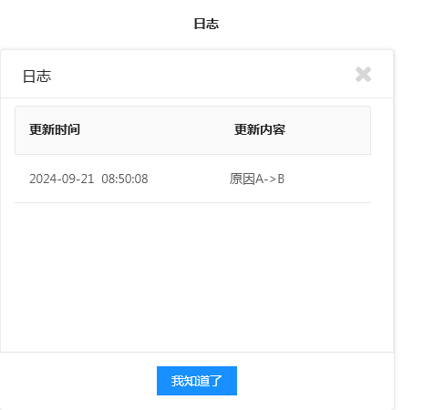 |
| 新增/修改退货原因 一级数据 1、编码：必填，系统默认生成推荐编码，支持人工调整校验唯一性，若修改时则不可修改编码 2、数据名称：必填，默认展示默认简体中文、繁体中文、英文、日文填写，校验同级别数据唯一性 3、适用产品线：必填，支持下拉单选”电商““新干线” 二级数据 1、排序：支持点击调整排序 2、编码：必填，系统默认生成推荐编码，支持人工调整校验唯一性，若修改时则不可修改编码 3、数据名称：必填，默认展示默认简体中文、繁体中文、英文、日文填写，校验同级别数据唯一性 4、~~外显数据名称：必填，默认展示默认简体中文、繁体中文、英文、日文填写，校验同级别数据唯一性~~ 5、是否对外展示：非必填，当勾选为”是“则该原因支持对C展示选择； 6、状态：新增默认生效，修改进入是支持操作生效失效； 操作按钮 1、修改：已创建的二级数据支持修改； 2、生效、失效按钮：点击展示二次提示弹窗， 3、点击确认后，后端更新退货原因展示信息； ~~3、日志：点击展示对应数据创建、修改日志，按照时间倒序展示~~ ==初始化需要配置退货原因供后端使用== ==90001001：支付超时取消==   ==90001002：支付完成预定失败取消== ==90001003:供应商侧取消订单== ==99999999： 其他原因== ==88888001：支付风控退款== |  |  |

## 3.4APP更新配置

| **功能** | **原型** | **说明** |
| --- | --- | --- |
| 4.1APP更新配置 | 4.1.1APP更新配置列表 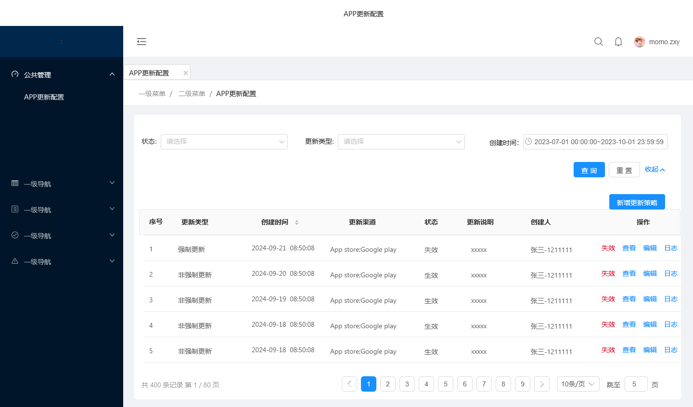 4.1.2新增更新策略 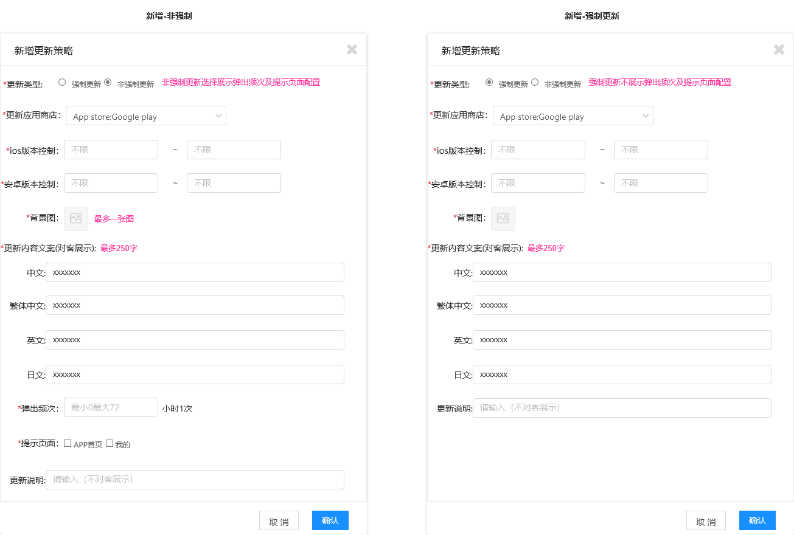 | 列表查询 1、状态：默认为空，可查询全部，支持下拉单选“生效”“失效” 2、更新类型：默认为空，可查询全部，支持下拉单选“强制更新”“非强制更新” 3、创建时间：默认为空，可查询全部，支持按照创建时间区间进行筛选； 列表展示： 1、默认展示序号（列表按照创建时间倒序排）、更新类型、创建时间（支持点击调整排序）、更新渠道、状态、更新说、创建人 操作按钮 1、新增更新策略：点击进入新增更新策略页面 2、列表按钮：展示生效（状态失效时展示）、失效（状态生效时展示）、查看、编辑、日志（按照时间倒序记录创建、修改、生效失效等操作）按钮 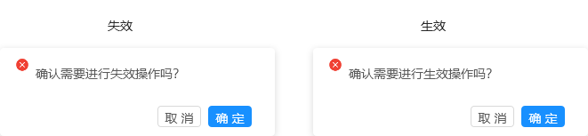 新增更新策略 1、更新类型：必填，单选，默认非强制更新，可以单选强制更新 2、更新应用商店：必填，多选，支持下拉多选App store、Google play(应用商店走数据字典配置，后续可能新增) 3、ios版本控制：应用商店选择App store展示，必填，支持录入版本号区间，校验开始版本号必须小于&等于结束版本号，忽略空格； 4、安卓版本控制：应用商店选择Google play展示，必填，支持录入版本号区间，校验开始版本号必须小于&等于结束版本号，忽略空格； 5、背景图：必填，支持最多上传一张图片； 6、更新内容（对客展示）：必填，多语言录入（中文、繁体中文、英文、日文），最多录入250字； 7、更新说明：必填，最多录入100字； 8、弹出频次：当选择”非强制更新“时展示，必填，支持录入整数最小1，最大72；(后续前端按照该配置小时数展示更新弹窗) 9、提示页面：当选择”非强制更新“时展示，必填，支持多选”APP首页“”我的“ 10、确认：点击确认时，提示”保存成功“，状态默认为”失效“ 11、取消：点击取消时，展示浮窗，点击确认关闭弹窗；  12、关闭：点击关闭时，展示浮窗，点击确认关闭弹窗；  若同一个版本存在多个更新配置策略则以最新生效的配置为准，后续更新弹出频次也取最新生效配置 |

<!-- LLM 提示: 此文档包含 28 张图片，保存在 /private/var/folders/fx/y7p6q13x6nx969vg4lzwswwm0000gn/T/vibe-kanban/worktrees/e5b0-mastergo-mcp/vibe-mcp/docs/公共部分需求/公共部分需求/assets/ 目录中。你可以读取这些图片文件来获取视觉信息。 -->